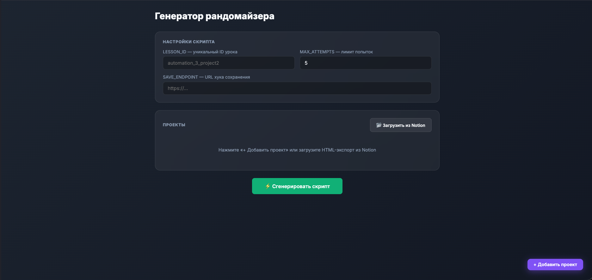

# Randomaze Generator



Инструмент для генерации рандомайзера учебных проектов, встраиваемого в GetCourse (или любую платформу с поддержкой HTML-блоков).

**Открыть онлайн:** https://mitrokhina202020-star.github.io/randomaze-generator/2026-06-15_randomaze-gen_page.html

## Что это

Веб-приложение для технических специалистов онлайн-курсов. Превращает текстовый список проектов в готовый HTML+JS-код рандомайзера для вставки в урок.

Вводишь параметры (ID урока, лимит попыток, адрес для отправки результата), добавляешь проекты текстом или загружаешь экспорт из Notion — и на выходе получаешь готовый фрагмент кода для вставки в урок.

## Возможности

- **Редактор проектов** — добавление карточек с названием и описанием с форматированием (жирный, заголовки, списки)
- **Импорт из Notion** — загрузка HTML-экспорта страницы с раскрывающимися блоками; каждый блок становится отдельным проектом
- **Настройка параметров** — ID урока, лимит попыток, адрес для отправки выбора студента (webhook)
- **Два блока кода на выходе** — HTML-разметка и JS-скрипт для вставки в урок
- **Не требует установки** — один файл, никаких дополнительных настроек

## Как работает сгенерированный блок

```
Студент открывает урок
    ↓
Нажимает «Получить проект» → рандомайзер выбирает проект из списка
    ↓
Может поменять проект (ограниченное число раз), каждый выбор попадает в историю
    ↓
Нажимает «Сохранить» → данные отправляются на указанный адрес (webhook):
    { lesson_id, user_id, project_title, project_desc, attempts_left, timestamp }
```

Состояние (попытки, история, выбор) хранится в браузере студента и не сбрасывается при перезагрузке страницы.

## Требования

Не требует сервера — достаточно открыть файл в браузере.

## Использование

1. Открыть `2026-06-15_randomaze-gen_page.html` в браузере
2. Заполнить ID урока, лимит попыток и адрес для отправки результата
3. Добавить проекты вручную кнопкой «+ Добавить проект» или загрузить Notion HTML-экспорт
4. Нажать **«Сгенерировать скрипт»**
5. Скопировать готовый код и вставить в HTML-блок урока в GetCourse

### Импорт из Notion

Экспортировать страницу из Notion: File → Export → HTML. Страница должна содержать раскрывающиеся блоки (тогглы) — каждый блок распознаётся как отдельный проект: заголовок → название, содержимое → описание.

## Структура файла

Всё приложение — один файл:

| Слой | Описание |
|------|----------|
| HTML/CSS | Тёмный интерфейс, адаптивный |
| JS — редактор | Карточки проектов с форматированием текста, панель инструментов |
| JS — импорт | Чтение Notion HTML через `DOMParser`, преобразование блоков в карточки |
| JS — генератор | `buildOutput()` и `buildSimpleOutput()` собирают готовый код построчно |

## Лицензия

MIT
